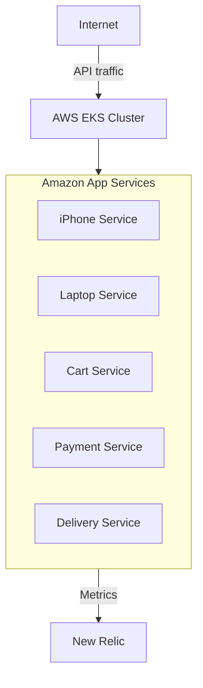

# Amazon eCart Microservices Platform

This repository contains a full Python-based microservices scaffold for the Amazon eCart project, designed for end-to-end deployment on AWS EKS using Terraform and Helm.

## What is included

- 5 Python microservices:
  - `iphone` — iPhone catalog service
  - `laptop` — Laptop catalog service
  - `cart` — Cart management service
  - `payment` — Payment processing service
  - `delivery` — Delivery tracking service
- Dockerfiles for each microservice
- Terraform infrastructure modules for AWS:
  - `vpc` — VPC, public/private subnets, internet gateway
  - `iam` — IAM roles for EKS cluster and node groups
  - `eks` — Managed EKS cluster plus node group
- Environment-specific Terraform directories:
  - `terraform/envs/dev`
  - `terraform/envs/stage`
  - `terraform/envs/prod`
- Helm chart for application deployment: `helm/amazon`
- Helm values for New Relic monitoring: `helm/monitoring`
- Root `Makefile` for common build and deploy commands

## Architecture



## Directory structure

- `services/` — microservice source code, requirements, and Dockerfiles
- `helm/amazon/` — Helm chart to deploy all 5 microservices inside EKS
- `helm/monitoring/` — New Relic deployment values
- `terraform/modules/` — reusable Terraform modules for VPC, IAM, and EKS
- `terraform/envs/` — environment-specific infrastructure entry points

## Python microservices

Each service is implemented with FastAPI and exposes a `/health` endpoint plus service-specific routes. Example startup:

```bash
cd services/iphone
docker build -t amazon-iphone:latest .
```

## Helm deployment

Install Helm if not already installed, then add the New Relic Helm repo:

```bash
helm repo add newrelic https://helm-charts.newrelic.com
helm repo update
```

Deploy the application chart to EKS:

```bash
helm upgrade --install amazon-apps ./helm/amazon --namespace amazon-app --create-namespace -f helm/amazon/values.yaml
```

Deploy New Relic for monitoring:

```bash
helm upgrade --install amazon-monitoring newrelic/nri-bundle --namespace amazon-monitoring --create-namespace -f helm/monitoring/values.yaml
```

## Terraform environments

Each environment has its own Terraform configuration and example variables file.

- `terraform/envs/dev/terraform.tfvars.example`
- `terraform/envs/stage/terraform.tfvars.example`
- `terraform/envs/prod/terraform.tfvars.example`

Run Terraform from the desired environment:

```bash
cd terraform/envs/dev
terraform init
terraform plan -var-file=terraform.tfvars
terraform apply -var-file=terraform.tfvars
```

## Terraform module design

- `terraform/modules/vpc` creates a VPC, public and private subnets, and an internet gateway.
- `terraform/modules/iam` creates EKS cluster and node group IAM roles with the correct AWS managed policies.
- `terraform/modules/eks` creates the EKS cluster and managed node group.

## New Relic monitoring

The monitoring setup now uses New Relic for Kubernetes and infrastructure observability. The `helm/monitoring/values.yaml` file enables:

- New Relic infrastructure monitoring
- Kubernetes cluster visibility
- kube-state-metrics integration

Replace the placeholder license key in the values file before deploying to a real environment.

## Notes and next steps

- AWS credentials and ECR credential management are not included in this scaffold.
- Replace image repository names in `helm/amazon/values.yaml` with your actual ECR repos once ECR is available.
- Use the admin AWS account carefully; when ready, apply least-privilege IAM policies instead of broad admin access.
- If you want, I can also add a separate `terraform/remote-backend.tf` for S3 state locking and a CI/CD pipeline configuration.

## Helpful commands

```bash
make build-images
make tf-init
make tf-plan
make tf-apply
make helm-install
```

## What is missing by design

- ECR login and image push steps (security credentials should be provided later)
- Real database persistence for services (the services are currently in-memory stubs)
- Ingress / load balancer manifests (these can be added once you choose an ingress controller)
- Production-grade secrets management for New Relic credentials and service configuration

## ALB Ingress (AWS Load Balancer Controller)

This project includes a host-based ALB Ingress for the `payment` service only. The hostname used in the Helm values is:

- `payment-service.com`

Prerequisites:

- EKS cluster up and running
- The AWS Load Balancer Controller installed in the cluster (recommended via Helm and IRSA)
- An OIDC provider for the cluster (for IRSA) or alternatively use a role with sufficient permissions

Install the AWS Load Balancer Controller (recommended with IRSA):

1. Create the IAM policy for the controller using the official policy document from the AWS docs.
2. Create an IAM role for the controller service account and allow `sts:AssumeRoleWithWebIdentity` from your cluster OIDC provider.
3. Install via Helm (example):

```bash
# add EKS charts and update
helm repo add eks https://aws.github.io/eks-charts
helm repo update

# install the controller (adjust cluster name, region, and serviceAccount annotations for IRSA)
helm upgrade --install aws-load-balancer-controller eks/aws-load-balancer-controller \
  --namespace kube-system --set clusterName=<CLUSTER_NAME> --set serviceAccount.create=false \
  --set serviceAccount.name=aws-load-balancer-controller
```

If you don't use IRSA, the controller still works if it can access AWS with credentials that have the required permissions (not recommended for production).

### Install the AWS Load Balancer Controller ServiceAccount via Helm

A dedicated helper chart is provided at `helm/alb-controller` to create the controller ServiceAccount and attach the IRSA role ARN.

First, retrieve the role ARN from Terraform after provisioning:

```bash
cd terraform/envs/dev
terraform output -raw alb_controller_role_arn
```

Then install the service account chart into `kube-system`:

```bash
cd c:\Users\Hp\OneDrive\Desktop\Amazon
helm upgrade --install alb-controller ./helm/alb-controller \
  --namespace kube-system --create-namespace \
  --set roleArn=$(terraform output -raw alb_controller_role_arn)
```

Then install the AWS Load Balancer Controller itself:

```bash
helm repo add eks https://aws.github.io/eks-charts
helm repo update
helm upgrade --install aws-load-balancer-controller eks/aws-load-balancer-controller \
  --namespace kube-system --set clusterName=amazon-dev-eks \
  --set serviceAccount.create=false \
  --set serviceAccount.name=aws-load-balancer-controller
```

## cert-manager for certificate management

A helper chart is included at `helm/cert-manager` to install cert-manager and create a Let's Encrypt `ClusterIssuer`.

Configure the issuer in `helm/cert-manager/values.yaml`:

- `clusterIssuer.email`: contact email for ACME registration
- `clusterIssuer.environment`: staging or production
- `clusterIssuer.dnsProvider`: DNS provider type (Route53 supported)
- `clusterIssuer.region`: AWS region for Route53
- `clusterIssuer.hostedZoneID`: Route53 hosted zone ID
- `clusterIssuer.dnsSecretName`: name of the secret containing DNS credentials

Create the Route53 credential secret in the `cert-manager` namespace, for example:

```bash
kubectl create secret generic route53-credentials \
  --namespace cert-manager \
  --from-literal=secret-access-key=<AWS_SECRET_ACCESS_KEY>
```

Then install cert-manager with Helm:

```bash
make helm-install-cert-manager
```

## external-dns for Route53 DNS automation

A helper Helm chart is provided at `helm/external-dns` to install external-dns and create DNS records automatically for ALB hostnames.

After provisioning Terraform, retrieve the external-dns IAM role ARN:

```bash
cd terraform/envs/dev
terraform output -raw external_dns_role_arn
```

Update `helm/external-dns/values.yaml` with the returned ARN and your DNS settings, then install external-dns:

```bash
make helm-install-external-dns
```

The chart defaults to:

- `provider`: aws
- `registry`: txt
- `policy`: sync
- `txtOwnerId`: amazon-external-dns
- `domainFilters`: ["payment-service.com"]
- `sources`: ["service", "ingress"]

This allows `external-dns` to update Route53 records for the payment ALB automatically.

Once cert-manager and external-dns are installed, you can use both Kubernetes-managed DNS and certificate workflows in the cluster.

## Autoscaling for app services

The Amazon app Helm chart now includes a Horizontal Pod Autoscaler for each service under `helm/amazon/templates/hpa.yaml`.

Default autoscaling values are configured in `helm/amazon/values.yaml`:

- `autoscaling.enabled`: true
- `autoscaling.minReplicas`: 2
- `autoscaling.maxReplicas`: 5
- `autoscaling.targetCPUUtilizationPercentage`: 70

If you want to customize autoscaling per service, you can add a `autoscaling` block inside the individual service definition in `helm/amazon/values.yaml`.

For example:

```yaml
services:
  - name: payment
    port: 8000
    image:
      repository: amazon-payment
      tag: latest
    replicaCount: 2
    autoscaling:
      minReplicas: 2
      maxReplicas: 6
      targetCPUUtilizationPercentage: 60
```

Then deploy the app chart:

- The ALB Ingress manifest for the `payment` service is in `helm/amazon/templates/ingress-payment.yaml` and is enabled by default using the host in `helm/amazon/values.yaml`.
- If you want HTTPS on ALB, enable TLS in `helm/amazon/values.yaml` and provide an ACM certificate ARN:

```yaml
payment:
  ingress:
    enabled: true
    host: payment-service.com
    tls:
      enabled: true
      certificateArn: arn:aws:acm:us-east-1:123456789012:certificate/abcd-1234-efgh-5678
      redirectHttp: true
```

- Deploy the app chart after the controller is installed:

```bash
helm upgrade --install amazon-apps ./helm/amazon --namespace amazon-app --create-namespace -f helm/amazon/values.yaml
```

Notes:

- The ingress is configured as `internet-facing` and uses host-based routing for `payment-service.com`.
- TLS on ALB is enabled through `alb.ingress.kubernetes.io/certificate-arn` when `payment.ingress.tls.enabled` is true.
- If you want DNS automation, consider installing `external-dns` and using Route53.
